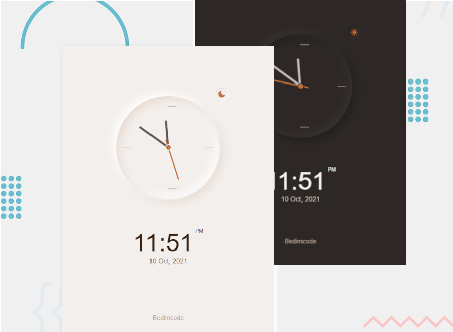

# BedimCode - Responsive Analog Clock - ([Click Here](https://samueloliveiraa.github.io/responsive-analog-clock/))

## WELCOME! 👋

This is a website that was developed during the BedimCode channel lesson, where we set up the structure based on the Mobile First model. This is a site that uses recent CSS3 technologies, which allowed us to also put a night mode and make it adapt to different screen sizes. This BedimCode channel is great for anyone who wants to learn techniques on how to develop a website in practice, as it shows us step by step how to develop the website.

## Follow the social networks of the BedimCode

* [Instagram](https://www.instagram.com/bedimcode/)
* [Channel on the Youtube](https://www.youtube.com/c/Bedimcode/videos) 
* [GitHub](https://github.com/bedimcode)
* [Facebook](https://www.facebook.com/bedimcode/)

## Technologies Used 🧩

* HTML5
* CSS3
* JavaScript
* Flexbox
* Media-Querie
* Grid Layout
* Responsive Website

## Access this site 💻

   I hosted this site with help of GitHub Pages. To access [Click Here](https://samueloliveiraa.github.io/responsive-analog-clock/)
